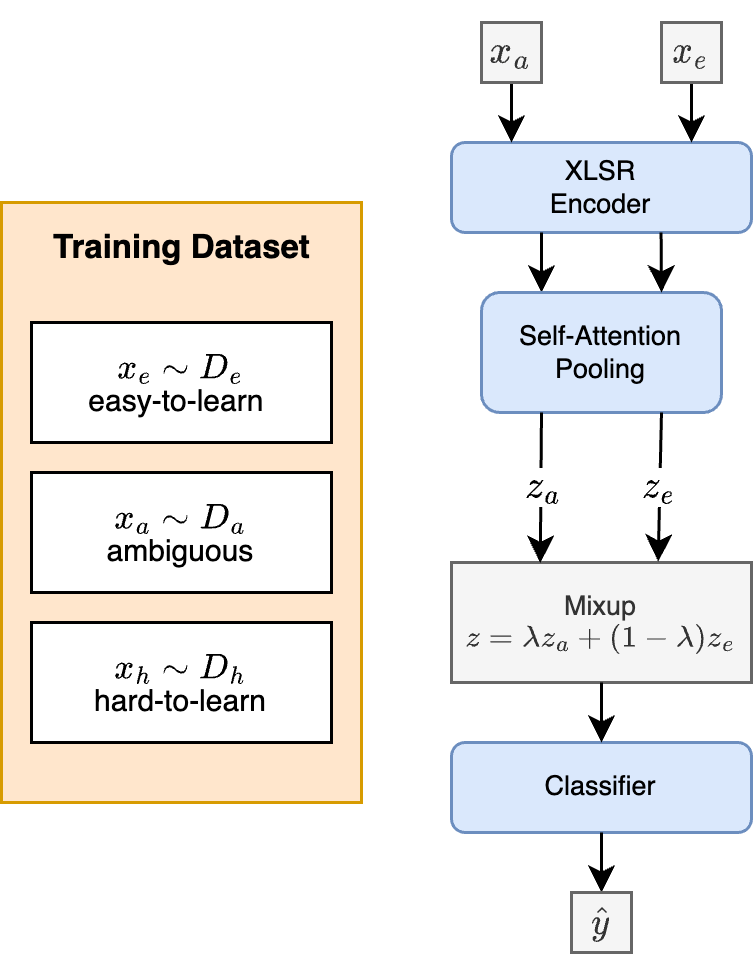
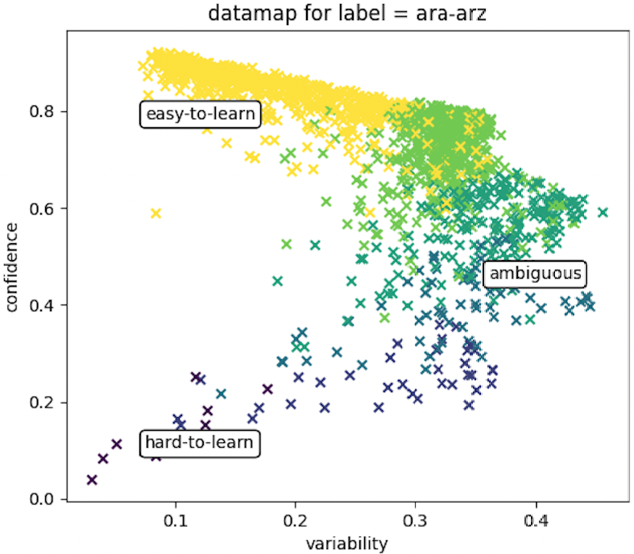
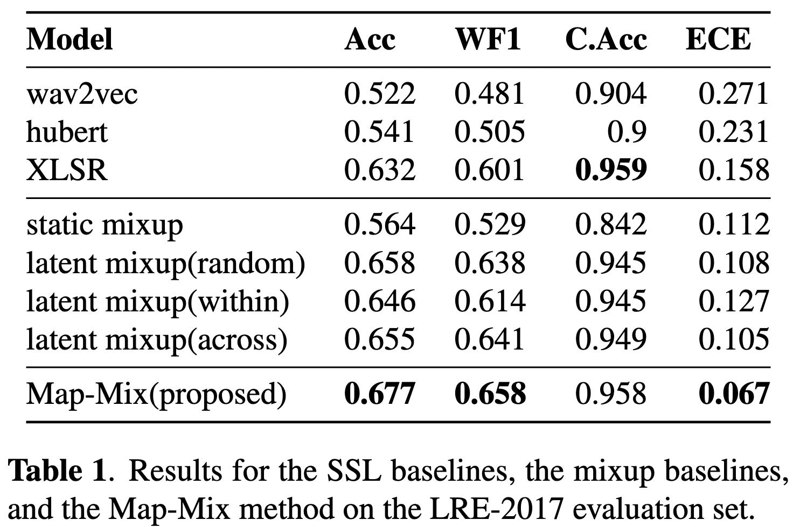
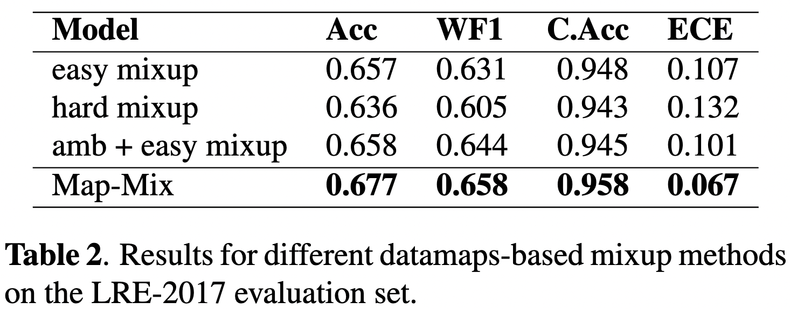

# Map-Mix

The official implementation of the paper **Improving Spoken Language Identification with Map-Mix**. 

## Table of Content
- [Map-Mix](#map-mix)
  - [Table of Content](#table-of-content)
  - [Introduction](#introduction)
  - [Citation](#citation)
  - [Requirements and Installation](#requirements-and-installation)
  - [Training](#training)
  - [Licence](#licence)
  - [Results](#results)

## Introduction

  
   

<!--   -->

## Citation

## Requirements and Installation

## Training

## Licence

## Results

 

